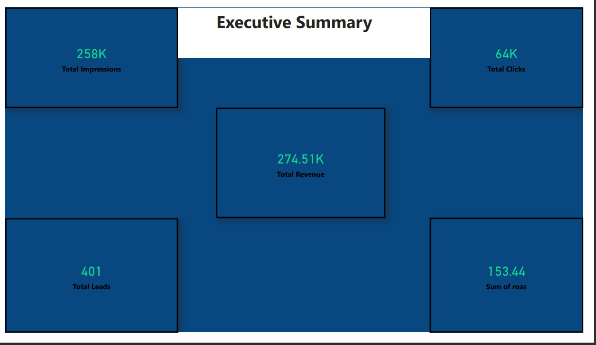
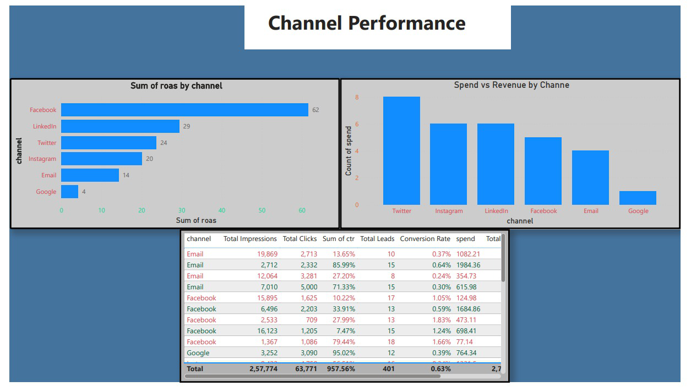
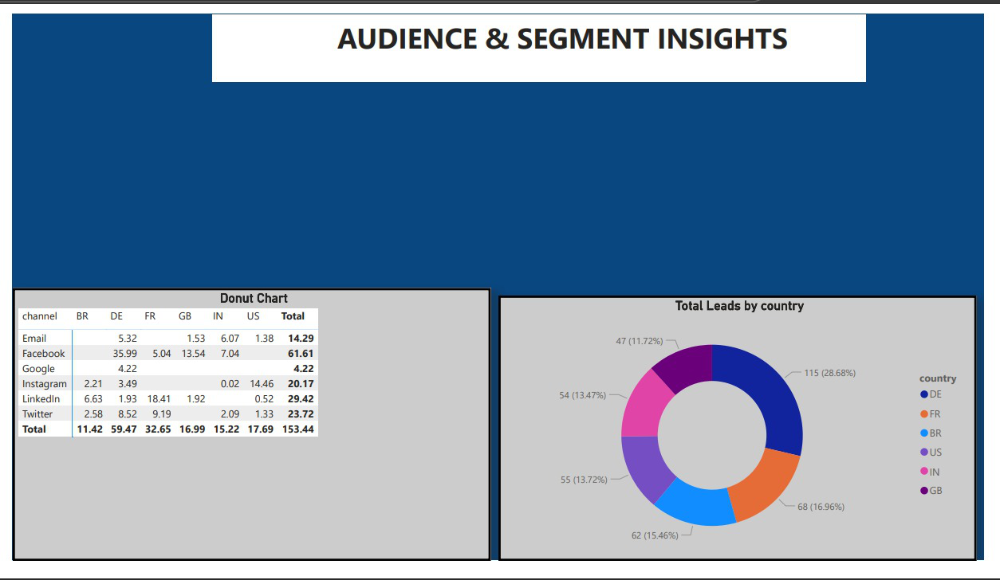
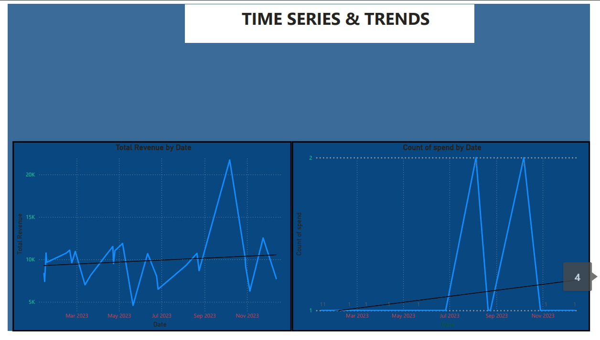
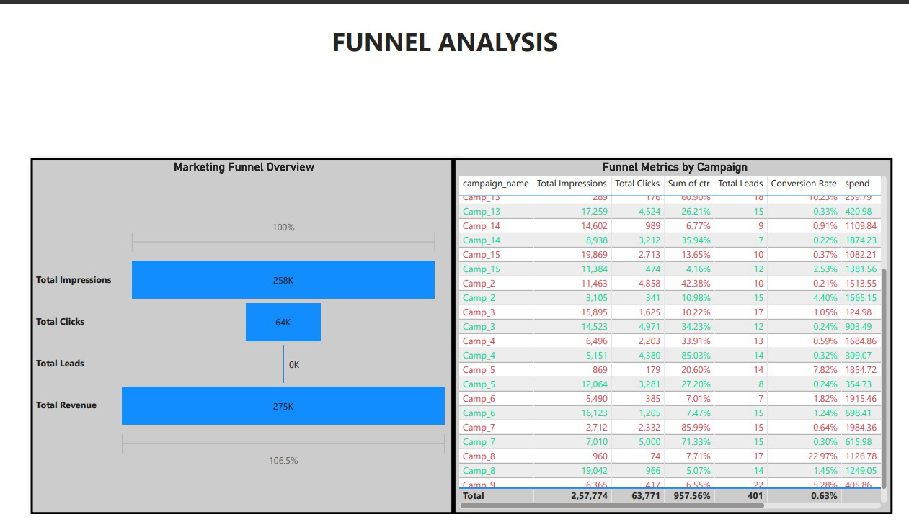

# 📢 Marketing Campaign Analytics — Power BI + SQL Project

An end-to-end **Marketing Performance & ROI Analytics** project using **Power BI, SQL, Power Query, and DAX** to analyze campaign performance across channels, regions, and customer acquisition.

This project showcases real-world digital marketing KPIs such as CTR, CPC, ROAS, Spend Efficiency, Conversion Behavior, and Retention.

---

## 🔧 Tech Stack
- Power BI Desktop  
- SQL  
- Power Query  
- DAX  
- Excel  
- Data Modeling  

---

## 📁 Folder Structure

```
Marketing_Campaign_Analytics_Project/
│
├── Data/
│   ├── Project4_Campaign_Performance.csv
│   ├── Project4_Customer_Acquisition.csv
│
├── Images/
│   ├── dashboard_1.png
│   ├── dashboard_2.png
│   ├── dashboard_3.png
│   ├── dashboard_4.png
│   ├── dashboard_5.png
│
├── Marketing_Campaign_Analytics.pbix
├── Marketing_Campaign_Analytics.pdf
└── README.md
```

---

## 🧩 Business Problem

Marketing teams struggle to understand:
- Which channels drive maximum impressions, clicks, and conversions  
- Spend wastage across campaigns  
- Customer acquisition patterns  
- Which campaigns produce high ROAS (Return on Ad Spend)  
- Retention of acquired customers (30-day basis)

This dashboard solves these issues using data analytics.

---

## 🎯 Project Goals

- Analyze multi-channel campaign performance  
- Track marketing KPIs such as CTR, CPC, ROAS  
- Identify top-performing campaigns and countries  
- Compare device-level engagement  
- Analyze customer acquisition behavior  
- Evaluate 30-day retention & churn  

---

## 📊 Dashboard Pages (5 Pages)

### **📌 Page 1 — Campaign Overview**
**Visuals:**
- Total Impressions (Card)  
- Total Clicks (Card)  
- Total Spend (Card)  
- Total Revenue (Card)  
- CTR, CPC, ROAS (KPI Cards)  
- Impressions by Channel (Bar Chart)  
- Clicks by Channel (Bar Chart)  

**Preview:**  


---

### **📌 Page 2 — Spend & Revenue Analysis**
**Visuals:**
- Spend Trend (Line Chart)  
- Revenue Trend (Line Chart)  
- Spend vs Revenue by Channel (Clustered Column Chart)  
- ROAS by Campaign (Bar Chart)  

**Preview:**  


---

### **📌 Page 3 — Customer Acquisition**
**Visuals:**
- Total Customers Acquired  
- Avg First Order Value  
- Acquisition by Channel  
- Acquisition by Country  
- Acquisition Trend by Date  

**Preview:**  


---

### **📌 Page 4 — Retention & Churn**
**Visuals:**
- Retention Rate (Card)  
- Churn Rate (Card)  
- Retained Customers by Channel  
- Retained vs Churned (Donut)  
- 30-Day Retention Trend (Line Chart)

**Preview:**  


---

### **📌 Page 5 — Campaign Deep Dive**
**Visuals:**
- Campaign Selector (Slicer)  
- Campaign CTR Trend  
- Campaign CPC Trend  
- Campaign ROAS Trend  
- Device Performance  

**Preview:**  


---

## 🛠️ SQL Queries Used

### **1. Basic Cleaning**
```sql
SELECT 
    campaign_id,
    channel,
    impressions,
    clicks,
    spend,
    revenue
FROM campaign_performance;
```

### **2. Click-Through Rate**
```sql
SELECT 
    campaign_id,
    (clicks * 1.0 / impressions) AS ctr
FROM campaign_performance;
```

### **3. Cost Per Click**
```sql
SELECT 
    campaign_id,
    CASE 
        WHEN clicks = 0 THEN NULL 
        ELSE spend / clicks 
    END AS cpc
FROM campaign_performance;
```

### **4. Return on Ad Spend**
```sql
SELECT 
    campaign_id,
    revenue / spend AS roas
FROM campaign_performance
WHERE spend > 0;
```

### **5. Customer Retention**
```sql
SELECT 
    channel,
    COUNT(*) AS total_customers,
    SUM(is_retained_30d) AS retained_customers,
    SUM(is_retained_30d) * 1.0 / COUNT(*) AS retention_rate
FROM customer_acquisition
GROUP BY channel;
```

---

## 📈 Key Insights

- Google & Facebook deliver the highest impressions and clicks  
- LinkedIn has the highest CPC but strong enterprise ROAS  
- Email channel shows low spend but best ROI  
- Retention highest on Desktop users  
- Campaigns with lower spend sometimes yield better ROAS  

---

## 👤 Author  
**G. Shyam Venkat**  
_Data Analyst | SQL | Power BI | DAX | Excel_

🔗 GitHub: https://github.com/shyamcodes-ai  
🔗 LinkedIn: https://linkedin.com/in/g-shyam-venkat-304ab536b  

---

⭐ If you found this project helpful, consider giving the repository a star!
